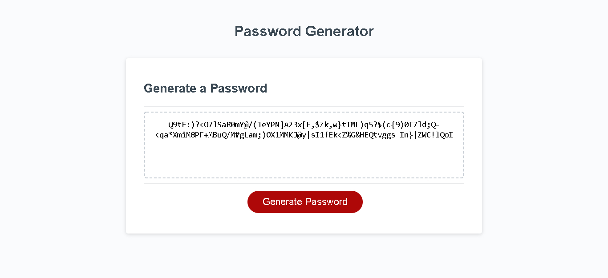

# Password-Generator



## Overview:
```
* I Used a while loop to ask user for a number input between 8 to 128
* If user enter a number lower than 8 or higher than 128 , or even enter anything but a number it prompts user to enter a number between 8 to 128.
* window.confirm() is used to ask user for the type of characters he/she wants to have in password.
* It requiers at least one type of characters, if user don't choose any, a prompt message will pop up.
* if statemens inside a function is used to gather password characters based on user choices.
* Finally a for loop is used to randomly  generates password characters based on the length of requested password.
```


## Links
The URL of the deployed application: https://ekhosr.github.io/Password-Generator/

The URL of the GitHub repository: https://github.com/ekhosr/Password-Generator.git
